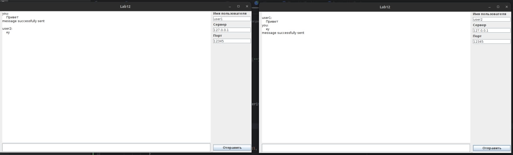

# Front-end многопоточного чата
Проект является мини лабораторной работой по изучению многопоточности и взаимодействия с сетью
## Main.java
Класс содержит подключение к порту, прослушивание и обработку входящих сообщений в отдельных потоках с помощью Threads.
Интерфейс выглядит следующим образом:

В большой белой области отображаются сообщения (беседа), в сером поле под ней можно ввести текст сообщения для отправки, кнопка отправить выполняет отправку сообщения в чат, в полях можно указать имя пользователя, сервер и порт для подключения к чату

Пример диалога:

## IncomingMessagesHandler.java
Класс нужен для реализации обработчика сообщений от других пользователей (их отправляет сервер) в отдельных потоках и выводе текста в поток вывода (элемент gui)

Пример получаемого сообщения: `user2:prikol`

## Серверная часть описана в проекте chat_server 
https://github.com/Egor-Pavlov/chat_server
