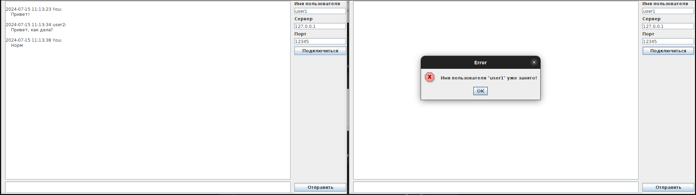

# Front-end многопоточного чата
Проект является мини лабораторной работой по изучению многопоточности и взаимодействия с сетью

## Сборка и запуск
1. Установить java17
2. Собрать проект в jar средствами ide (_build_ -> _build artifacts_)
3. java -jar chat_client.jar

## Main.java
Класс содержит подключение к порту, прослушивание и обработку входящих сообщений в отдельных потоках с помощью Threads.

При подключении необходимо ввести имя пользователя (оно должно быть уникальным). В противном случае приложение сообщит, что имя используется

Интерфейс выглядит следующим образом:

В большой белой области отображаются сообщения (беседа), в сером поле под ней можно ввести текст сообщения для отправки, кнопка отправить выполняет отправку сообщения в чат, в полях можно указать имя пользователя, сервер и порт для подключения к чату
У сообщений отправленных текущим пользователем вместо имени отправителя указано "you"

Пример диалога:

## client.gui.IncomingMessagesHandler.java
Класс нужен для реализации обработчика сообщений от других пользователей (их отправляет сервер) в отдельных потоках и выводе текста в поток вывода (элемент gui)

Пример получаемого сообщения: `{"username":"anonymous","text":"Проверка","timestamp":"2024-07-16T10:27:11+07:00[Asia/Novosibirsk]"}`

## Серверная часть описана в проекте chat_server 
https://github.com/Egor-Pavlov/chat_server
